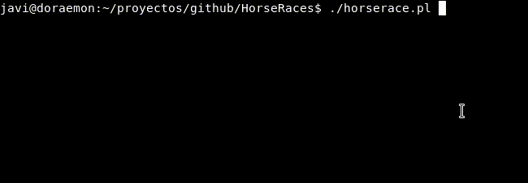
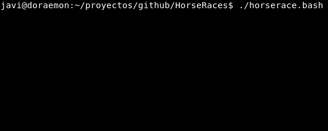
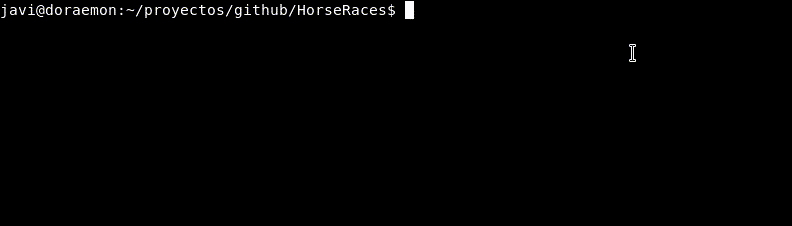
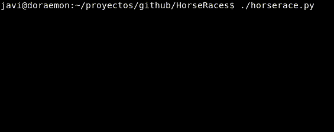
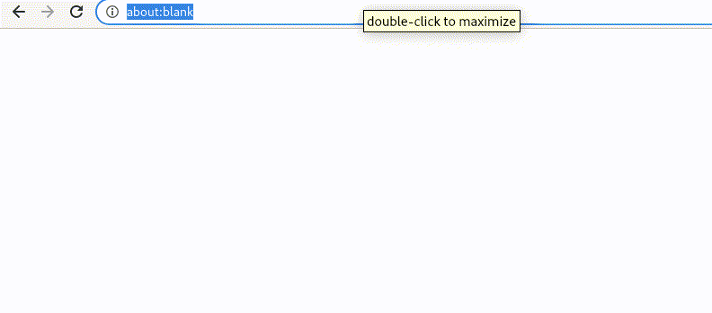

# HorseRaces
HorseRaces with your favourite programming language

## Perl
You will need to install Term::Screen (cpan install Term::Screen)
and apt install libanyevent-perl. You can see the original post at perlmonks:
https://www.perlmonks.org/?node_id=962940

## Bash
Should be rewrite to no use additional files

## Powershell
Script surely can be improved :D

## Python
Credit to Curses 

## JavaScript (HTML)
I will improve the gif (vokoscreen running on gnome3, a known issue)

# Pull request
Would be accepeted !

Gif saved with https://github.com/vkohaupt/vokoscreen
